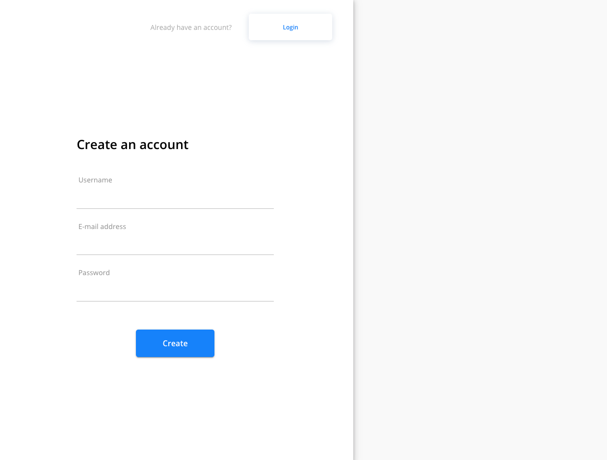

## TATTOO ART

TATTOO ART is a tattoo design contest website. Any user can create a contest for a tattoo design or submit a design to a contest.

**Tech Stack:** MongoDB, Express.js, React.js, Node.js, Typescript

**Contributors**: [Eric](https://github.com/eric-silva-61), [Jeri](https://github.com/jerixmx), [Khalil](https://github.com/yliu298),

---

### Getting Started

1. Clone or download repository.
2. Run `npm i` on both `client` and `server` directories.
3. Create and fill up `.env` files in the `client` and `server` directories where `sample.env` files are available.
4.

---

## Running the App

- To run `client` and `server` concurrently, issue `npm run dev` in the root directory.
- Separately, issue `npm run dev` in the `server` directory and `npm run start` in the `client` directory.

---

### Features

### Demo

1. Discovery Page

(replace)

2. Login / Registration Page

(replace)
