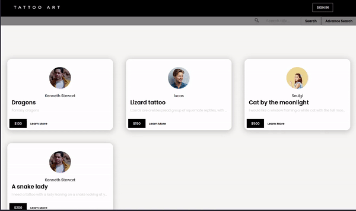
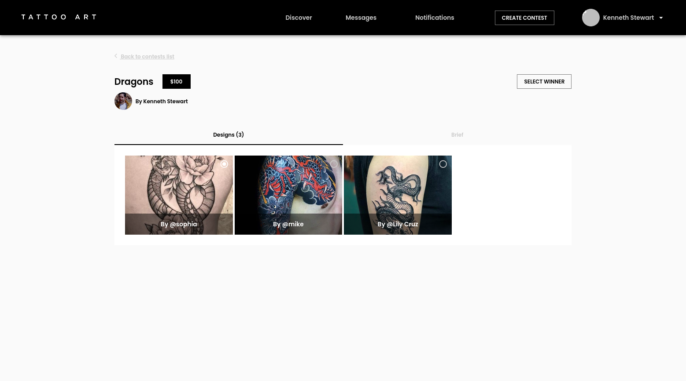
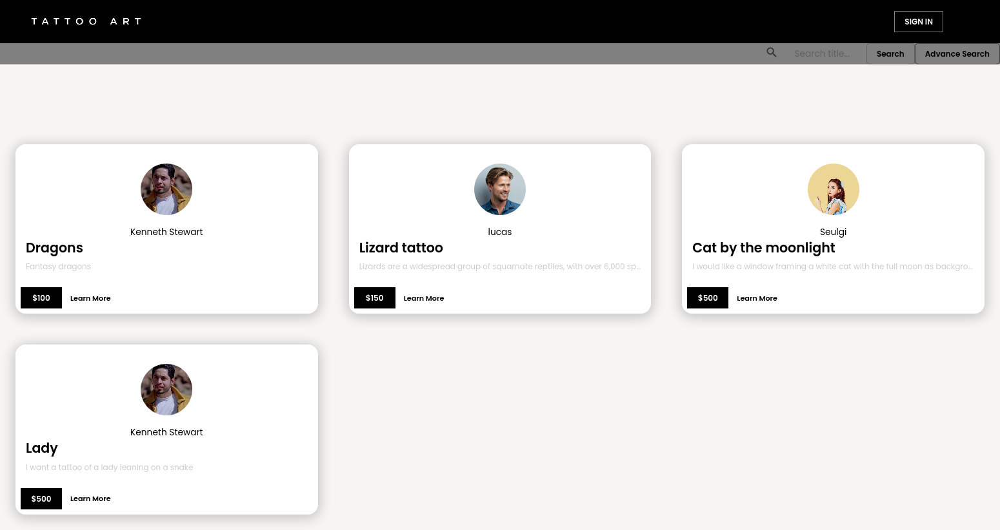
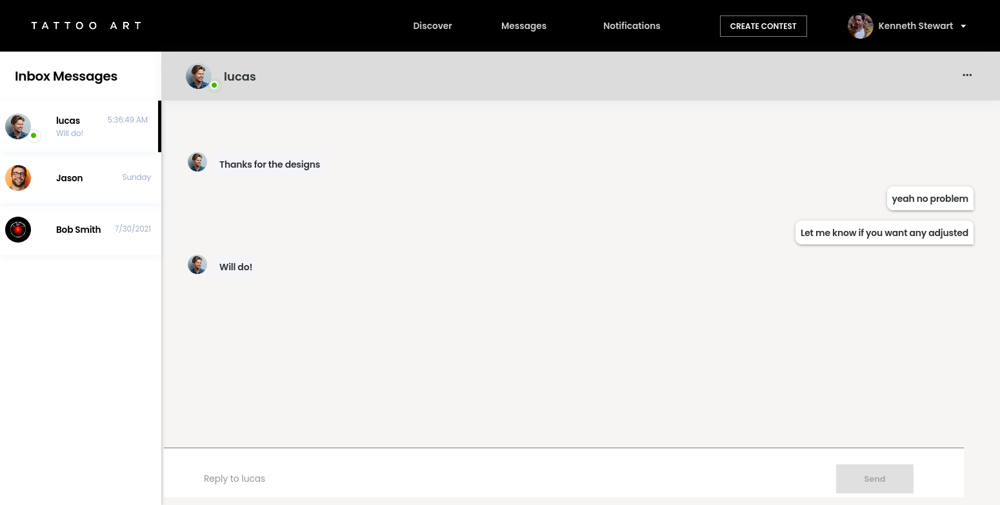
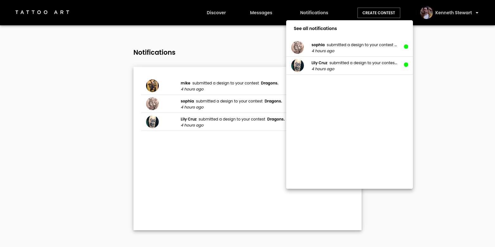
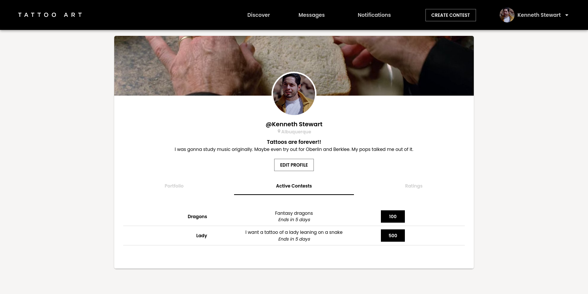

## TATTOO ART

TATTOO ART is a tattoo design contest website. Any user can create a contest for a tattoo design or submit a design to a contest.

**Tech Stack:** MongoDB, Express.js, React.js, Node.js, Typescript

**Contributors**: [Eric](https://github.com/eric-silva-61), [Jeri](https://github.com/jerixmx), [Khalil](https://github.com/yliu298), [Rajiv](https://github.com/rajivtitus)

### Features

1. Contest Creation
   
   Create a contest and set the deadline and prize amount. When the deadline ends, select a winner with your preferred payment method.
   Payments are managed with Stripe.
2. Design Submission
   
   Check out or search for contests on the Discovery page then submit your design. Contests allow for multiple submissions.
   Files are stored through Amazon S3.
3. Messaging
   
   Contact any of the submitters to your contest. Conversations are available in the messaging page so you can go back to a previous conversation. You can also see whether the intended recipient is online.
4. Notifications
   
   Receive notifications with the submission thumbnail when someone submits a design for your contest.
5. Profile
   
   Change your profile photo, cover photo, and add information about yourself. The profile page also showcases active contests.

---

### Getting Started

1. Clone or download repository.
2. Run `npm i` on both `client` and `server` directories.
3. Create and fill up `.env` files in the `client` and `server` directories where `sample.env` files are available.

### Running the App

- To run `client` and `server` concurrently, issue `npm run dev` in the root directory.
  OR
- Separately, issue `npm run dev` in the `server` directory and `npm run start` in the `client` directory.
